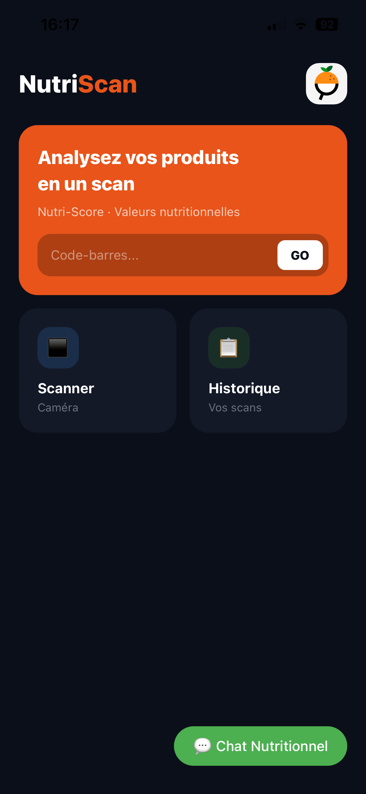
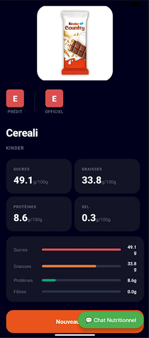
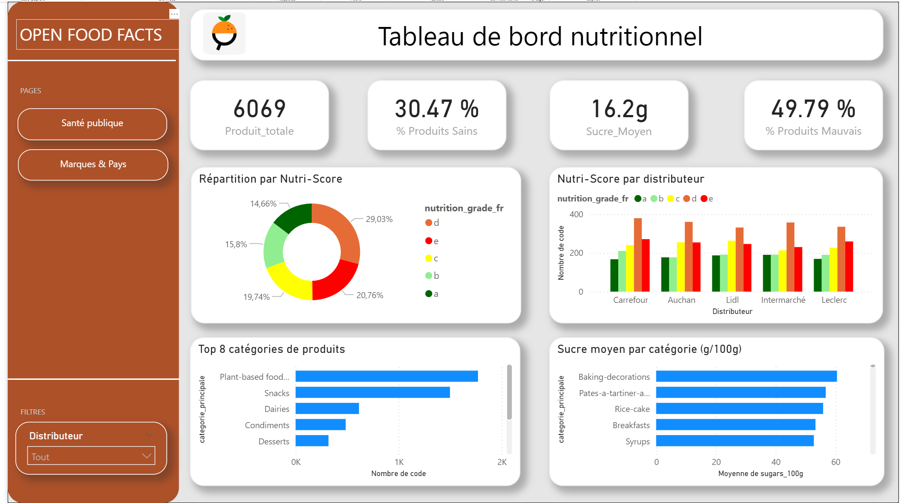

# 🍊 NutriScan AI - Data Ecosystem

> Application mobile d'analyse nutritionnelle basée sur l'IA,
> connectée à un écosystème de données complet.

## 🎯 Description
NutriScan permet de scanner des produits alimentaires et d'obtenir
une analyse nutritionnelle instantanée (Nutri-Score, sucres, graisses)
grâce à une recherche de similarité par IA (FAISS).

## 🧩 Composants du projet

| Composant         | Technologie         | Description                           |
| ----------------- | ------------------- | ------------------------------------- |
| App Mobile        | Expo / React Native | Scan produit + chatbot                |
| Similarité IA     | Python + FAISS      | Recherche de produits similaires      |
| Nettoyage données | KNIME               | Pipeline de nettoyage Open Food Facts |
| Modèle prédictif  | KNIME               | Prédiction qualité nutritionnelle     |
| Workflows         | n8n                 | Automatisation IA Agent + Modèle      |
| Dashboards        | Power BI            | Visualisation nutritionnelle          |
| RAG               | LangChain + API     | Agent conversationnel sur les données |

## 📸 Aperçu

### Application mobile



### Dashboards Power BI


## 📁 Structure du projet

```
NutriScan-AI-Data-Ecosystem/
├── mobile-app/        # Application Expo React Native
├── ml-model/          # FAISS + KNIME + scripts Python
├── n8n-workflows/     # Workflows d'automatisation
├── powerbi/           # Dashboards + captures
├── RAG/               # Agent conversationnel LangChain
└── docs/              # Rapports et documentation
```

## 🚀 Installation

### App Mobile
```bash
cd mobile-app/NutriScan3
npm install
npx expo start
```

### Scripts Python (FAISS)
```bash
cd ml-model/src
pip install -r requirements.txt
python similarity_search_labels.py
```

### RAG / Agent LangChain
```bash
cd RAG
pip install -r requirements.txt
cp .env.example .env  # Renseigner les clés API
python api.py
```

## 📊 Données
Le dataset source `en.openfoodfacts.org.products.csv` provient de
[Open Food Facts](https://world.openfoodfacts.org/data) (~12GB).
À télécharger séparément avant de lancer les scripts.

## 👤 Auteur
**Imam Magadiyev** — [GitHub](https://github.com/ImamMagadiyev)

## 🏫 Contexte
Projet réalisé dans le cadre de [ta formation] — 2026
